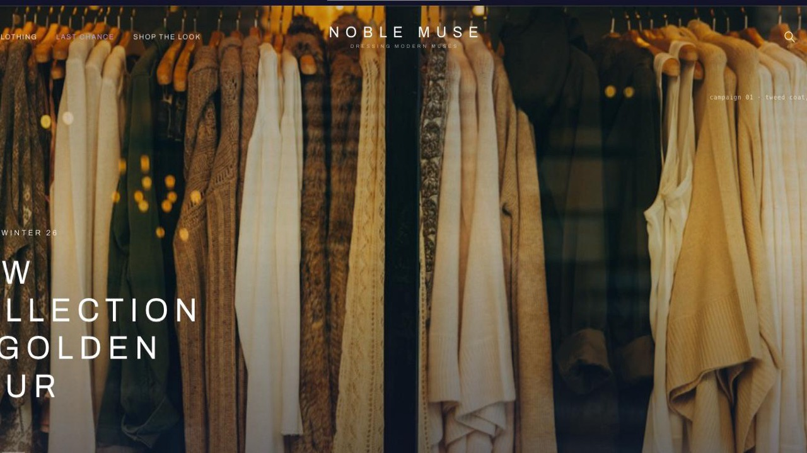

# Noble Muse — premium womenswear storefront

[](https://vercel.com/new/clone?repository-url=https://github.com/njbSaab/astro-njx-muse) [](https://app.netlify.com/start/deploy?repository=https://github.com/njbSaab/astro-njx-muse)

**Free fashion e-commerce theme for Astro.** Ink navy on white, tracked-caps
typography, a transparent masthead over a full-height campaign slider — the
structure of the big premium womenswear shops, built static.

**[Live demo →](https://astro-njx-muse.pages.dev)** ·
[More themes at njxui.dev](https://njxui.dev/themes)



## What's inside

- **Transparent-to-solid masthead** — fixed over the hero, turns solid white on
  scroll, hover or search; centred tracked-out wordmark, lilac "Last Chance".
- **Campaign hero slider** — three full-height slides with monospace shot notes
  and dash indicators.
- **Hover mega menu** — categories, curated highlights and a collection feature.
- **Slide-down search** with live results and popular-search chips.
- **Editorial home conveyor** — category tiles, double banners, NEW IN and
  TOPSELLER arrow carousels, a full-bleed tailoring banner, brand manifesto and
  a split newsletter section.
- **Shop the Look** — masonry of looks where a "+" hotspot opens the pieces
  worn in each look, with add-to-bag.
- **Cards that sell** — hover crossfade to the full-look shot, quick view and an
  inline quick-size add straight into the bag drawer.
- **Cart & wishlist drawers** — free-shipping progress bar, move-to-bag.
- **Catalog** — category / size / colour selects, max-price slider, sorting;
  reads `?cat=` and `?tag=` from the URL.
- **Once-per-visitor newsletter popup** (10% off) and a giant outlined wordmark
  footer with country, language and payment selectors.
- **SEO-ready** — static product pages with Product JSON-LD and Open Graph.

## Quick start

```bash
git clone https://github.com/njbSaab/astro-njx-muse.git
cd astro-njx-muse
npm install
npm run dev
```

Runs out of the box on the bundled 28-piece mock catalogue — no keys, no accounts.

## Connect Shopify (optional)

The commerce layer is provider-based. Two env vars switch it from mock data to
the Shopify Storefront API:

```bash
COMMERCE_PROVIDER=shopify
SHOPIFY_STORE_DOMAIN=your-store.myshopify.com
SHOPIFY_STOREFRONT_TOKEN=your-storefront-access-token
```

## Rebrand in two files

1. `scripts/gen-catalog.py` — categories, colours and the 28-piece catalogue.
2. `src/styles/global.css` — the ink, lilac and paper tokens.

## Stack

[Astro 5](https://astro.build) · [Tailwind CSS v4](https://tailwindcss.com) ·
[nanostores](https://github.com/nanostores/nanostores) — static output, deploys
anywhere (Cloudflare Pages, Netlify, Vercel, GitHub Pages).

## More themes

Noble Muse is part of the classic line at **[njxui.dev](https://njxui.dev/themes)** —
next to [Maison](https://github.com/njbSaab/astro-njx-maison) (free printed
archive), [Heritage](https://njxui.dev/themes/heritage) (classic luxury with a
full checkout, light + dark) and [Lumière](https://njxui.dev/themes/lumiere)
(three boutiques on one engine), plus free Shopify-ready storefronts.

## License

[MIT](LICENSE) — free for personal and commercial projects. A link back to
[njxui.dev](https://njxui.dev) is appreciated but not required.
